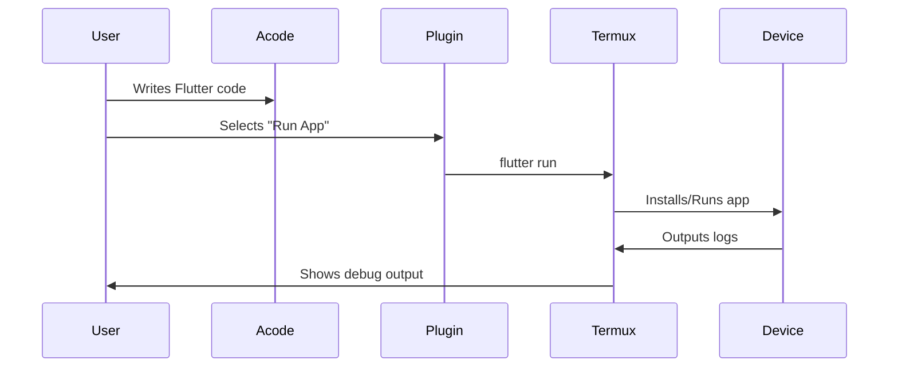

```markdown
- # 🚀 Flutter Compiler for Acode  
- **Turn your Android device into a full Flutter development environment**  
- *By [Mikael Kraft](https://github.com/mikaelkraft)*  

  

---

## ✨ Features  
- **One-tap Flutter SDK installer** (via Termux)  
- **Complete Flutter/Dart toolchain**:  
  ```bash
  flutter create | run | build | pub get | doctor
  dart analyze | format | test
  ```  
- **Firebase Tools integration**:  
  ```bash
  flutterfire configure | deploy
  ```  

---

## 📥 Installation  

### Prerequisites  
1. [Acode Editor](https://play.google.com/store/apps/details?id=com.foxdebug.acodefree)  
2. [Termux (F-Droid)](https://f-droid.org/en/packages/com.termux/)
3. [Acode X Terminal (Acode Plugin)] download from Acode's plugin directory.

### Installation  
1. In Acode:  
   ```
   Settings → Plugins → Install from URL:
   https://github.com/mikaelkraft/Flutter-Compiler
   ```  
## Or
1. Install Termux from [F-Droid](https://f-droid.org/)
2. Run below in Termux:

```
pkg install git acode
git clone https://github.com/mikaelkraft/Flutter-Compiler
acode install Flutter-Compiler

```

2. Accept all permissions  

---

## 🛠️ First-Run Setup  
The plugin will automatically:  
1. Install Flutter SDK in Termux (~1.5GB)  
2. Configure environment paths  
3. Verify with `flutter doctor`  

---

## 🎮 Usage  
Access all commands via:  
```
Acode Menu → Plugins → Flutter Compiler
```  

### Command Cheatsheet  
| Command               | Description                      |  
|-----------------------|----------------------------------|  
| **Flutter Doctor**    | Verify installation              |  
| **Pub Get**          | Install dependencies            |  
| **Build APK**        | Generate release APK            |  
| **Run App**          | Launch on connected device      |  
| **FlutterFire**      | Configure Firebase              |  

---


```markdown
## 🚀 Flutter Development in Acode - Full Workflow

### **1. Create a New Project**
1. Open Acode's file manager
2. Create a folder for your project (e.g. `my_app`)
3. In Termux:
```bash
cd /storage/emulated/0/Acode/my_app
flutter create .
```

2. Write Your Code

· Use Acode's editor for:
  · lib/main.dart (Main app code)
  · pubspec.yaml (Dependencies)

3. Run Commands via Plugin

Access these through:

```
Acode Menu → Plugins → Flutter Compiler
```


### Command Cheatsheet Refreshed  
| **When you need to...**    | Use this                      |  
|-----------------------|----------------------------------|  
| **install dependencies**    | `Pub Get`              |  
| **Launch on device**          | `Run App (Connect device via USB debugging first)`            |  
| **Build APK**        | Build APK`            |  
| **Add Firebase**          | `FlutterFire Setup`      |  
| **Check for errors**      | Code Analysis             |  

---


4. Debugging Workflow

1. Make code changes in Acode
2. Run - flutter run - through the plugin
3. View logs directly in Termux

5. Building for Release

```bash
# Via plugin menu:
1. Build AppBundle (for Play Store)
2. Build APK (for direct install)
```

6. Advanced Usage

Hot Reload (After running app):

1. Save changes in Acode **(Ctrl+S)**
2. Press **r** in Termux where **`flutter run`* is active

Testing:

```bash
# Via plugin:
Run Tests → Executes `flutter test`
```

7. Project Management

· Clean Project: Removes build files
· Repair Packages: Fixes dependency issues

```

### **Plugin UI Flow**:


This workflow leverages the plugin's tight integration with Termux while keeping Acode as the primary code editor. The key advantages are:

1. 📴 No Cloud Required - Everything runs locally on device
2. ☯️ Full IDE Experience - Acode for editing + Termux for execution
3. 🕹️ Seamless Commands - One-tap access to all Flutter tools


## ❓ Troubleshooting  

### Common Issues  
| Error                  | Solution                          |  
|------------------------|-----------------------------------|  
| `Termux not found`    | Install from F-Droid (required)   |  
| `Storage access`      | Run: `termux-setup-storage`       |  
| `Flutter not found`   | Re-run installer manually:        |  
```bash
bash /storage/emulated/0/Acode/plugins/Flutter_Compiler/assets/termux_install.sh
```  

---

## 🛠️ Technical Details  

### Plugin Structure  
```
flutter_compiler_acode/  
├── plugin.json          # Metadata  
├── main.js              # Core logic  
└── assets/  
    ├── flutter_icon.png  
    └── termux_install.sh # Auto-installer  
```  

---

## 📜 License  
MIT © [Mikael Kraft](https://github.com/mikaelkraft)  

[](https://github.com/mikaelkraft/Flutter-Compiler)
```
