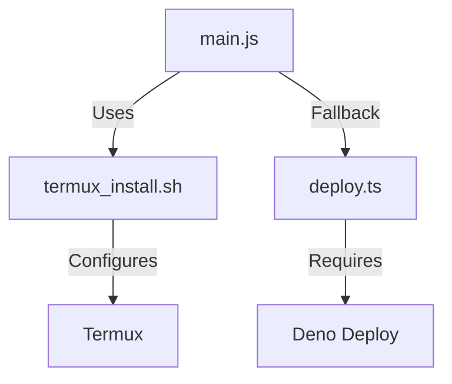

#### B. **`cloud/README_CLOUD.md`** (Self-Hosting Guide)
```markdown
# Self-Hosted Cloud Setup

1. **Deploy to Deno**:
   ```bash
   deno deploy --project=your-project deploy.ts
   ```

2. **Configure Plugin**:
   - In Acode: `Settings → Flutter Compiler`
   - Paste your endpoint URL:
     ```
     https://your-project.deno.dev
     ```

3. **Usage**:
   - Failed local commands will auto-retry via cloud
```

---

### 🧩 **How Files Work Together**
